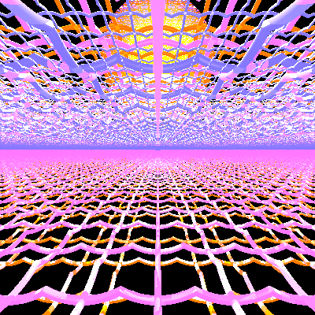
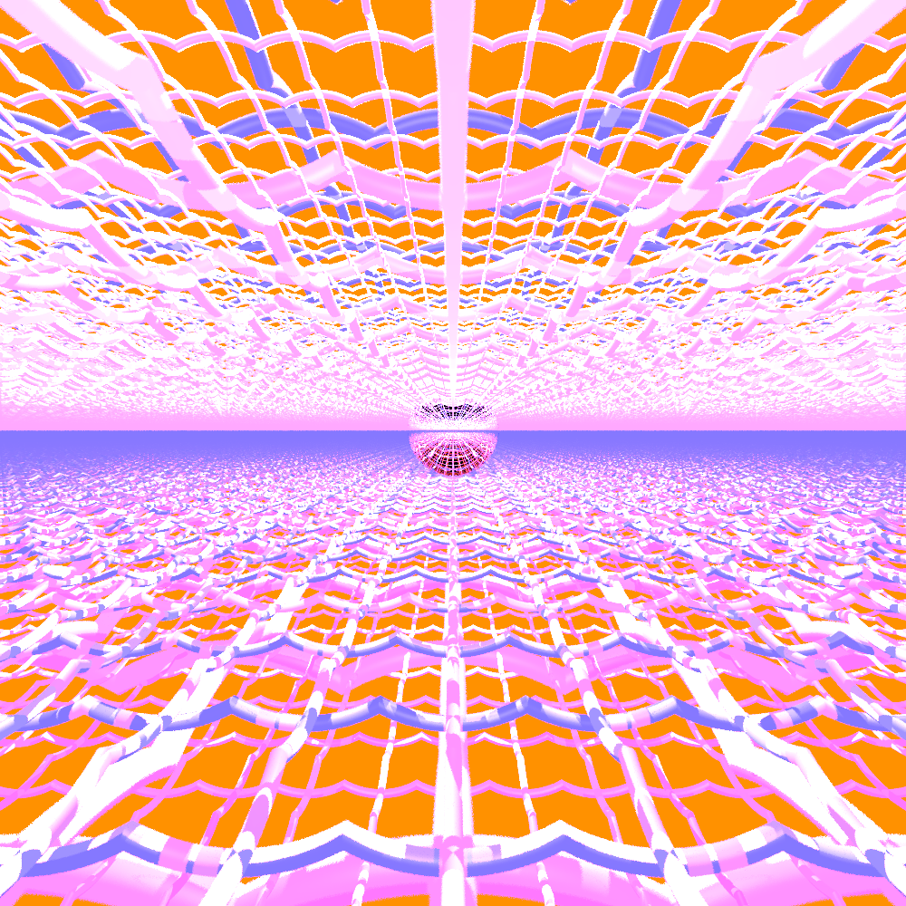
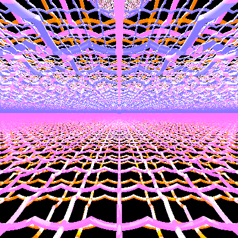
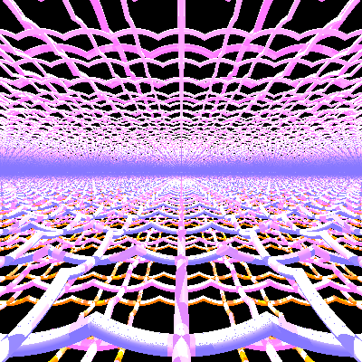
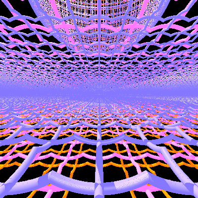
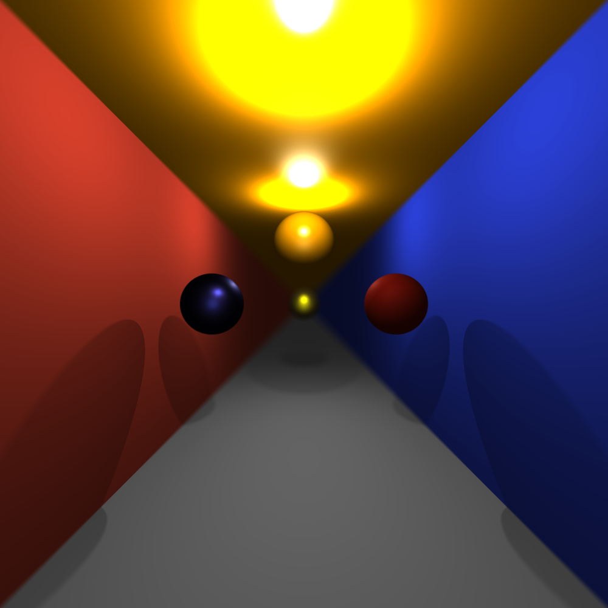
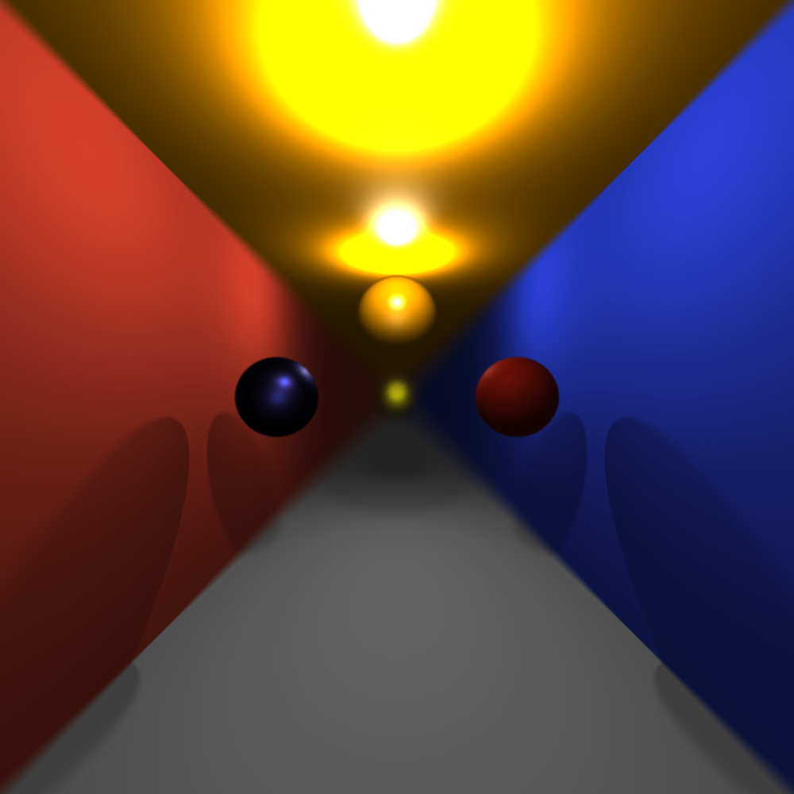
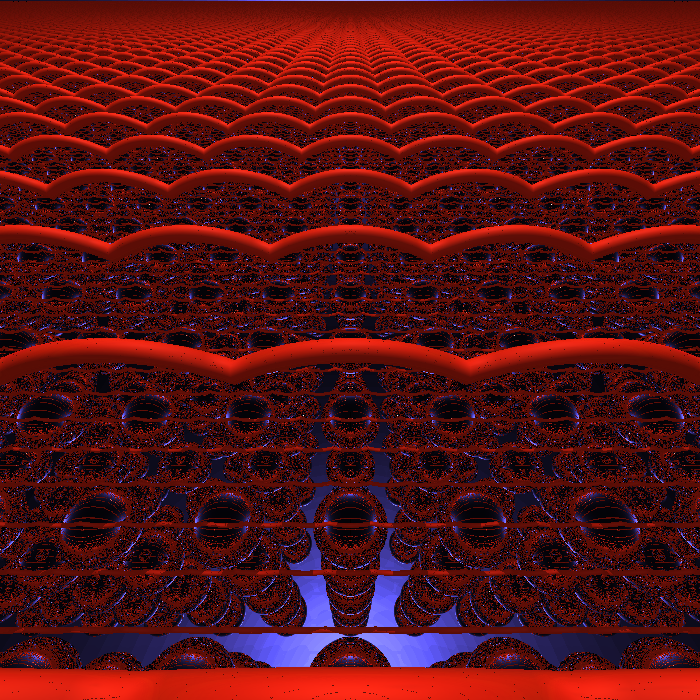
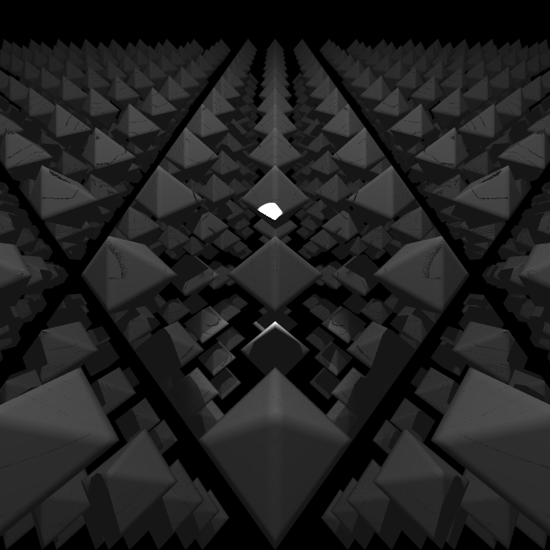
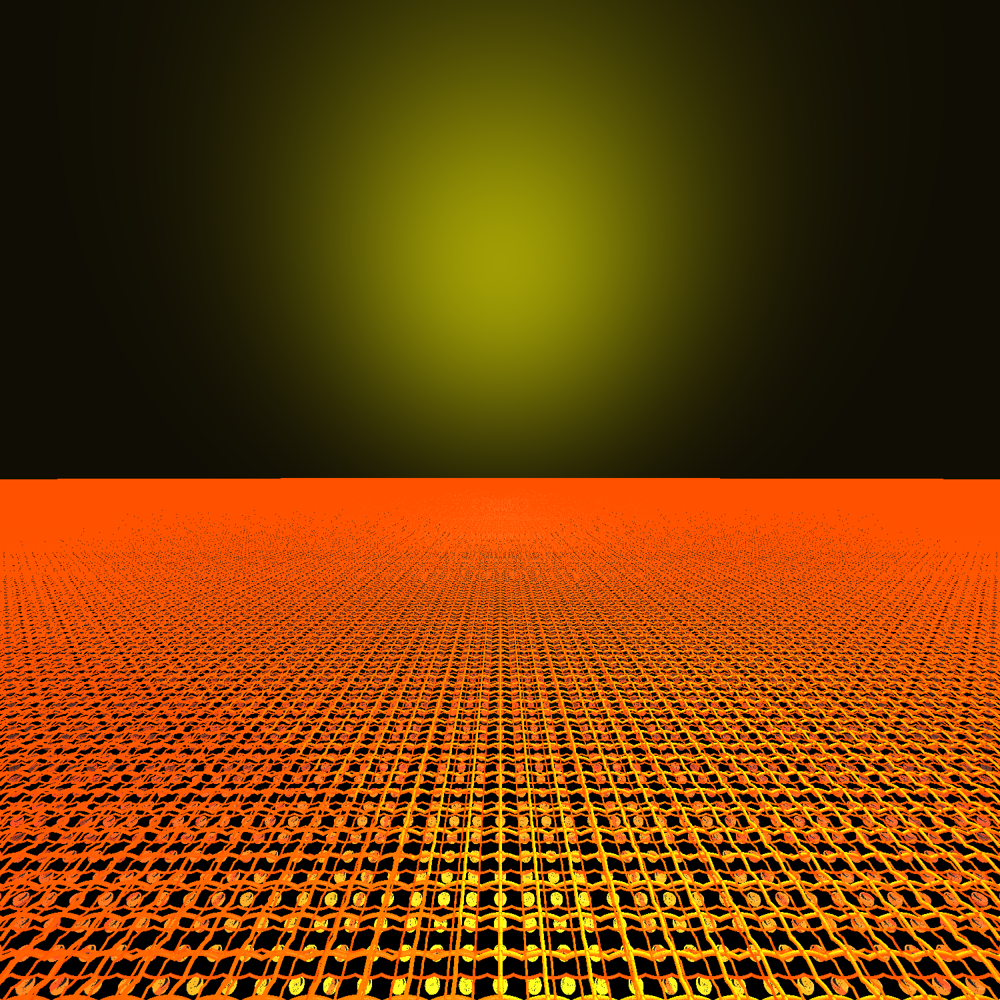

# raytracer-raymarcher
A custom raytracer combined with a raymarcher to create cool scenes and infinite objects with depth of field implemented. 
Currently only CPU support is implemented!

## Some examples

    
    
    
    
    
    
    
    
    
    
    
    
    
    
    
    
    
    

